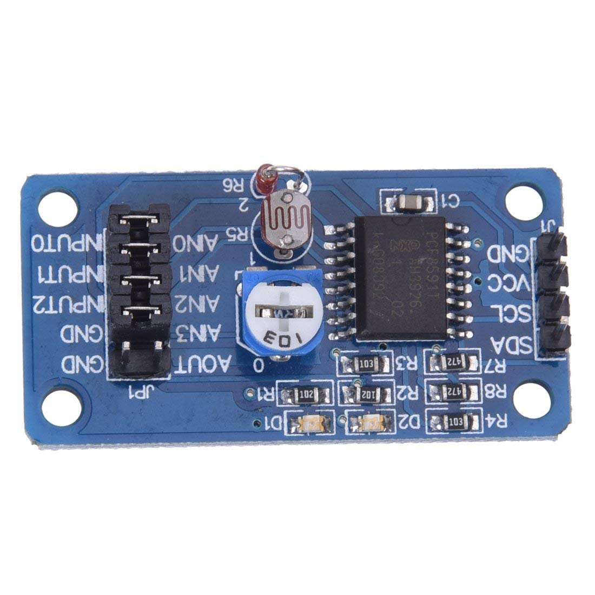
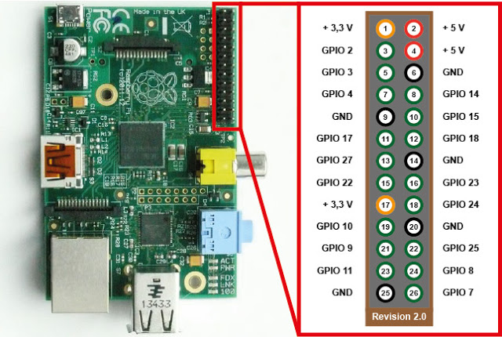

# PCF8591_Python_Library_Example

This small repo is created for the Minor ICT for NON-ICT'ers from the university of applied siences Utrecht by Oscar kromhout on 13-1-2021. 
The example has a PCF8591 class which contains some very basic code to read out (and optional write) data from the PCF8591 using Python. 
It is completely based on the library from Shudiamonds. See: https://github.com/ShuDiamonds/PCF8591. All credits for creating this code except for the example on the lower side of the document go to him/her. I only used his/her code to create a simple to use example and document for the minor students.
Because Shundiamonds had originally placed his library under the MIT license I decided to also add this license to this repo.

## Requirements

- Raspberry pi (i tested it on a 3b+)
- PCF8591
- wires (and breadboard)
- Python 3
- The Wiring pi library

## how to start

- Run "sudo raspi-config" in the terminal
- Go to interfaces and enable I2C
- Finish
- Run "pip3 install wiringpi" in the terminal
- Wire the PCF8591 as described in the chapter "wiring"
- Run "python3 PCF8591.py" in the terminal to confirm it working
- Copy the PCF8591 class to your own project and use it like the example

## how to wire
PCF			pi

gnd		->	gnd

vcc		->	5V

scl		->	scl

sda		->	sda

a0/a3in -> 	whatever you want to read

